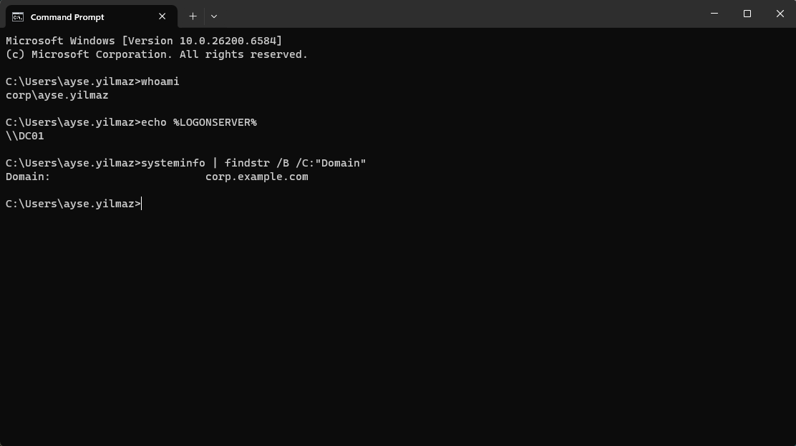
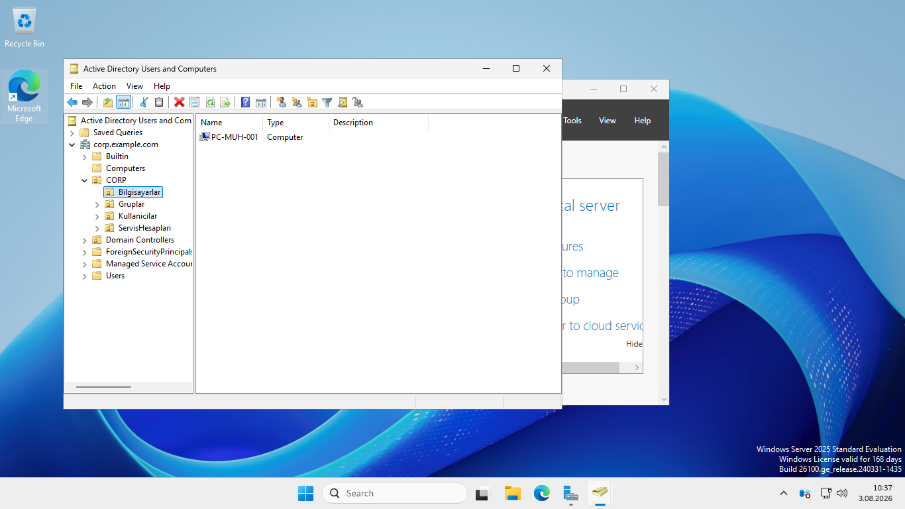

# Windows 11 İstemcisini Active Directory Domainine Katma

Bu bölümde `PC-MUH-001` adlı Windows 11 Enterprise istemcisi, `corp.example.com` Active Directory domainine katılmış ve domain kullanıcısıyla oturum açma işlemi doğrulanmıştır.

> Bu çalışma yalnızca izole ve yetkili bir eğitim laboratuvarında gerçekleştirilmiştir. Kullanıcılar, bilgisayar adları, domain ve IP adresleri hayalidir.

## Kullanılan sistemler

| Sistem | Görev | IP / Ağ |
|---|---|---|
| DC01 | Active Directory Domain Services ve DNS | `192.168.32.10` |
| PC-MUH-001 | Windows 11 Enterprise istemcisi | VMware NAT / DHCP |

Domain adı: `corp.example.com`

## 1. Bilgisayar adının düzenlenmesi

İstemcinin otomatik oluşturulan bilgisayar adı, laboratuvarın isimlendirme standardına uygun olarak `PC-MUH-001` şeklinde değiştirildi.

```powershell
Rename-Computer -NewName "PC-MUH-001"
```

Bilgisayar adı değişikliği yeniden başlatma sonrasında etkinleşti.

## 2. DNS yapılandırması

Active Directory istemcileri, domain controller ve domain servis kayıtlarını bulabilmek için Active Directory ile bütünleşik DNS sunucusunu kullanmalıdır. Bu nedenle istemcinin IPv4 DNS adresi DC01'in adresi olan `192.168.32.10` olarak ayarlandı.

```powershell
Set-DnsClientServerAddress -InterfaceAlias "Ethernet0" -ServerAddresses "192.168.32.10"
```

Ayar aşağıdaki komutla doğrulandı:

```powershell
Get-DnsClientServerAddress -InterfaceAlias "Ethernet0" -AddressFamily IPv4
```

## 3. Ağ ve Active Directory DNS testleri

Önce istemci ile DC01 arasındaki IP bağlantısı test edildi:

```cmd
ping 192.168.32.10
```

Ardından DC01'in adı ve LDAP SRV kaydı sorgulandı:

```cmd
nslookup dc01.corp.example.com
nslookup -type=SRV _ldap._tcp.dc._msdcs.corp.example.com
```

SRV sorgusunda `dc01.corp.example.com` sunucusu ve LDAP için TCP `389` portu döndü. Bu sonuç, istemcinin domain controller bulma aşamasının çalıştığını doğruladı.

## 4. Domaine katılma

`sysdm.cpl` üzerinden **Computer Name > Change** ekranı açıldı ve istemci `corp.example.com` domainine katıldı. İşlem, laboratuvar ortamındaki yetkili `CORP\Administrator` hesabıyla onaylandı ve bilgisayar yeniden başlatıldı.

## 5. Domain kullanıcısıyla ilk oturum

Yeniden başlatma sonrasında `CORP\ayse.yilmaz` hesabıyla ilk domain oturumu açıldı. Oturumun domain üzerinden gerçekleştiği aşağıdaki komutlarla doğrulandı:

```cmd
whoami
echo %LOGONSERVER%
systeminfo | findstr /B /C:"Domain"
```

Beklenen ve doğrulanan sonuçlar:

```text
corp\ayse.yilmaz
\\DC01
Domain: corp.example.com
```



## 6. Bilgisayar nesnesinin OU'ya taşınması

Domaine yeni katılan bilgisayar nesnesi başlangıçta varsayılan `Computers` konteynerinde oluştu. Daha sonra Group Policy ve yetkilendirme çalışmalarında düzenli yönetilebilmesi için aşağıdaki OU'ya taşındı:

```text
CORP
└── Bilgisayarlar
    └── PC-MUH-001
```



## Sorun giderme notu

İlk DNS sorgusunda zaman aşımı görüldü. Sorun katmanlara ayrılarak incelendi:

1. `ping 192.168.32.10` ile IP bağlantısı doğrulandı.
2. DC01 üzerinde DNS hizmetinin çalıştığı kontrol edildi.
3. DC01'in yerel DNS sorgusuna cevap verdiği doğrulandı.
4. İstemciden DNS ve LDAP SRV sorguları tekrarlandı.

Gecikmenin, 16 GB RAM kullanılan ana bilgisayarda iki sanal makinenin aynı anda çalışması ve istemci sanal diskinin HDD üzerinde bulunmasıyla ilişkili olduğu değerlendirildi. DC01 sanal makinesinin SSD'ye taşınmasının ardından DNS sorguları başarıyla tamamlandı.

## Sonuç

- İstemci adı kurumsal isimlendirme örneğine göre düzenlendi.
- İstemcinin DNS adresi DC01 olarak yapılandırıldı.
- DNS ve LDAP SRV kayıtları doğrulandı.
- PC-MUH-001, `corp.example.com` domainine katıldı.
- `CORP\ayse.yilmaz` hesabıyla domain oturumu doğrulandı.
- Bilgisayar nesnesi `CORP\Bilgisayarlar` OU'suna taşındı.

Bir sonraki aşamada bu OU üzerinde Group Policy yapılandırmaları uygulanacaktır.
