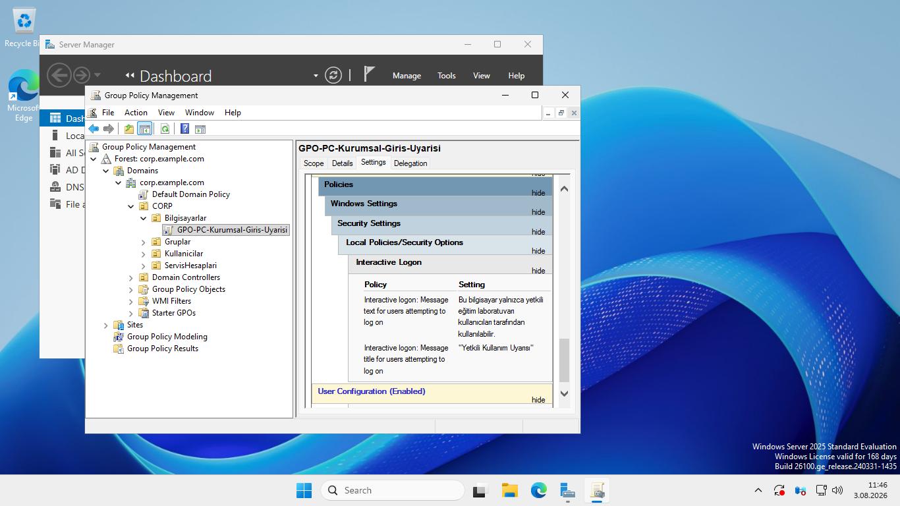
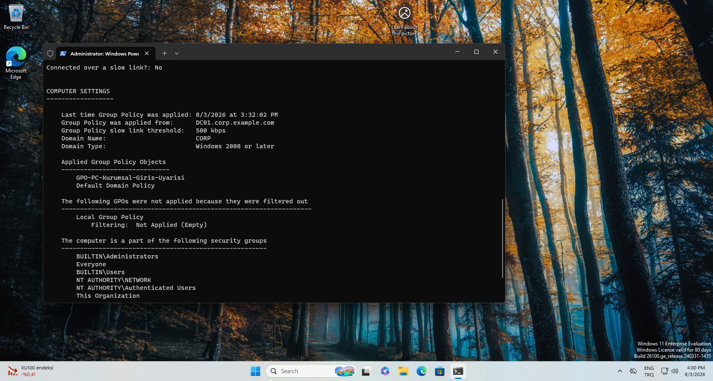
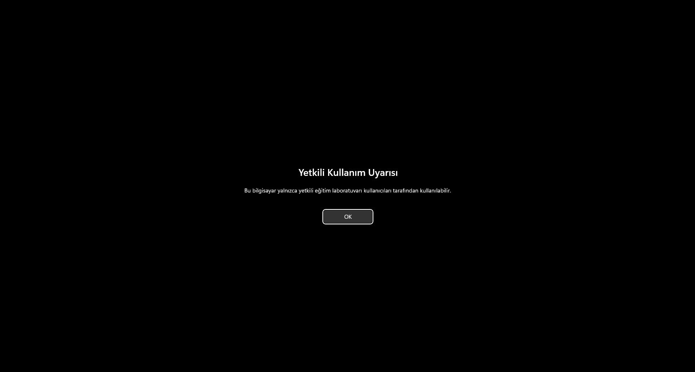

# Group Policy ile Kurumsal Oturum Açma Uyarısı

Bu çalışmada, domaine bağlı Windows 11 istemcilerine merkezi olarak bir oturum açma uyarısı göstermek amacıyla Group Policy Object (GPO) oluşturuldu ve uygulandığı doğrulandı.

## Amaç

- Ayarı her bilgisayarda ayrı ayrı yapmak yerine Active Directory üzerinden merkezi olarak dağıtmak
- Politikanın yalnızca ilgili bilgisayarların bulunduğu OU'ya uygulanmasını sağlamak
- İstemcide politikanın uygulandığını hem komut çıktısıyla hem de kullanıcı ekranıyla doğrulamak

## Laboratuvar bileşenleri

| Bileşen | Değer |
|---|---|
| Domain | `corp.example.com` |
| Domain Controller | `DC01` |
| İstemci | `PC-MUH-001` |
| Hedef OU | `CORP/Bilgisayarlar` |
| GPO adı | `GPO-PC-Kurumsal-Giris-Uyarisi` |

## 1. GPO'nun oluşturulması ve bağlanması

Group Policy Management Console (GPMC) üzerinden `GPO-PC-Kurumsal-Giris-Uyarisi` adlı bir GPO oluşturuldu. GPO, bilgisayar hesaplarının bulunduğu `CORP/Bilgisayarlar` OU'suna bağlandı.

Bu bağlantı sayesinde politika, domain içindeki tüm sistemlere değil yalnızca bu OU altında bulunan bilgisayarlara uygulanır.

## 2. Oturum açma uyarısının yapılandırılması

Aşağıdaki yol kullanıldı:

```text
Computer Configuration
└── Policies
    └── Windows Settings
        └── Security Settings
            └── Local Policies
                └── Security Options
```

Yapılandırılan ayarlar:

- **Interactive logon: Message title for users attempting to log on**  
  `Yetkili Kullanım Uyarısı`
- **Interactive logon: Message text for users attempting to log on**  
  `Bu bilgisayar yalnızca yetkili eğitim laboratuvarı kullanıcıları tarafından kullanılabilir.`



Bu ayar `Computer Configuration` altında bulunduğu için kullanıcı hesabına değil bilgisayara uygulanır.

## 3. Politikanın istemcide yenilenmesi

PC-MUH-001 üzerinde yönetici yetkili komut satırında aşağıdaki komut çalıştırıldı:

```cmd
gpupdate /force
```

Bu komut, bilgisayarın ve kullanıcının Group Policy ayarlarını domain controller'dan yeniden almasını zorlar.

## 4. Uygulamanın doğrulanması

İstemciye uygulanan bilgisayar politikalarını görmek için şu komut kullanıldı:

```cmd
gpresult /r /scope computer
```

Çıktıdaki **Applied Group Policy Objects** bölümünde aşağıdaki GPO görüldü:

```text
GPO-PC-Kurumsal-Giris-Uyarisi
```



Bu sonuç; istemcinin DC01 ile iletişim kurabildiğini, bilgisayar hesabının doğru OU'da bulunduğunu ve GPO'nun istemciye ulaştığını gösterir.

## 5. Kullanıcı tarafındaki sonuç

PC-MUH-001 yeniden başlatıldı. Oturum açma ekranından önce yapılandırılan uyarı başlığı ve metni görüntülendi.



## Sorun giderme yaklaşımı

Politika görünmezse aşağıdaki sıra izlenebilir:

1. İstemcinin DNS sunucusunun DC01'i (`192.168.32.10`) gösterdiğini kontrol et.
2. Bilgisayar hesabının `CORP/Bilgisayarlar` OU'sunda olduğunu doğrula.
3. GPO'nun doğru OU'ya bağlı ve bağlantının etkin olduğunu kontrol et.
4. `gpupdate /force` ile politikaları yenile.
5. `gpresult /r /scope computer` ile GPO'nun uygulanıp uygulanmadığını kontrol et.
6. Gerekirse bilgisayarı yeniden başlat; bazı bilgisayar politikaları açılış sırasında tamamlanır.

GPMC içindeki **Settings** raporu görüntülenirken Internet Explorer Enhanced Security uyarısı çıkarsa bu, politikanın bozuk olduğu anlamına gelmez. Uyarı, MMC içindeki yerel HTML raporunun güvenlik kısıtlamasıyla ilgilidir.

## Sonuç

Bu uygulamada merkezi bir bilgisayar politikası oluşturuldu, hedef OU'ya bağlandı, istemcide uygulandığı komutla doğrulandı ve kullanıcıya görünen sonuç test edildi. Böylece Group Policy'nin kurumsal ortamlarda çok sayıda bilgisayara standart ayar dağıtma mantığı uygulamalı olarak gösterildi.
